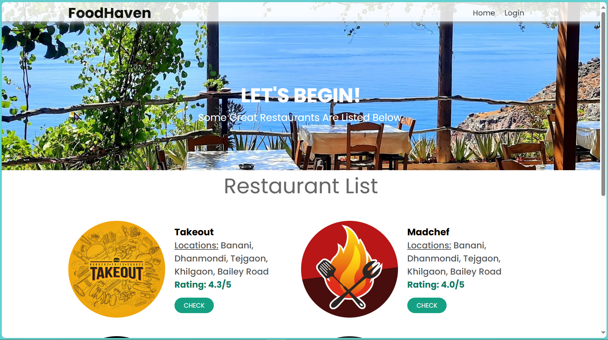
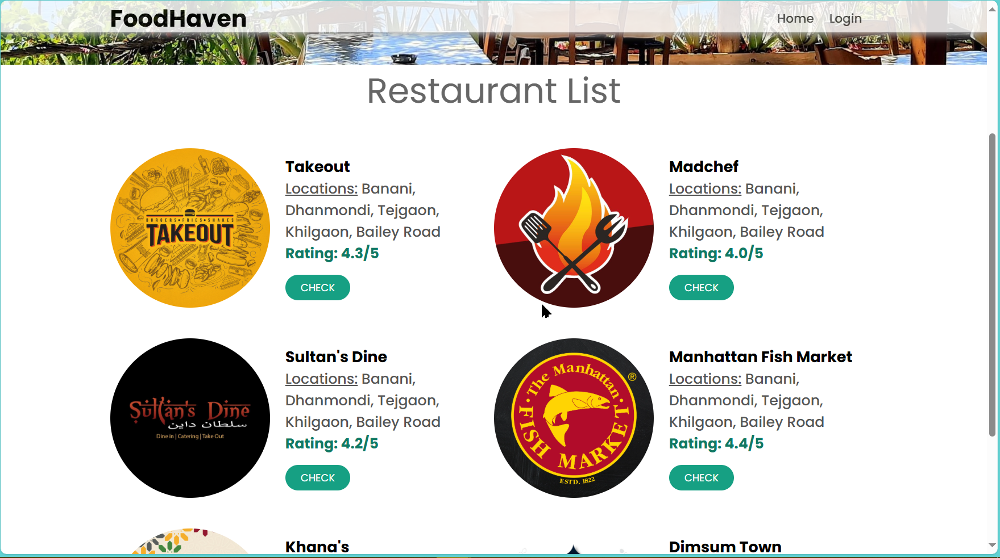

# 🍽️ Webapp Restaurant

A modern and versatile restaurant web application with a user-friendly interface, dynamic menu, reservation system, and responsive design. Built with PHP, HTML, and CSS for seamless deployment and easy customization.

---

## 🚀 Features

- 📋 Online Menu Showcase  
- 📝 Reservation/Order Form  
- 📱 Fully Responsive Design  
- ⚡ Fast & Lightweight  
- 🎨 Easy Customization

---

## 🖼️ Screenshots

---

## 🎥 Demo

[▶️ Demo Video](Demo%20Video.mp4)

---

## 🛠️ Technologies Used

- PHP
- HTML5 & CSS3

---

## 🏁 Getting Started

git clone https://github.com/aarefinn/webapp-restaurant.git
cd Webapp_Restaurant

Start PHP server:
php -S localhost:8080

Then visit [http://localhost:8080](http://localhost:8080) in your browser.

---

## 👥 Contributors

- Syed Shamsul Arefin ([aarefinn](https://github.com/aarefinn))

---

## 📄 License

MIT License

---

## 🤝 Contact

For support, questions or contributions, open an issue or connect via hello@syedarefin.dev

Clone this repository:

